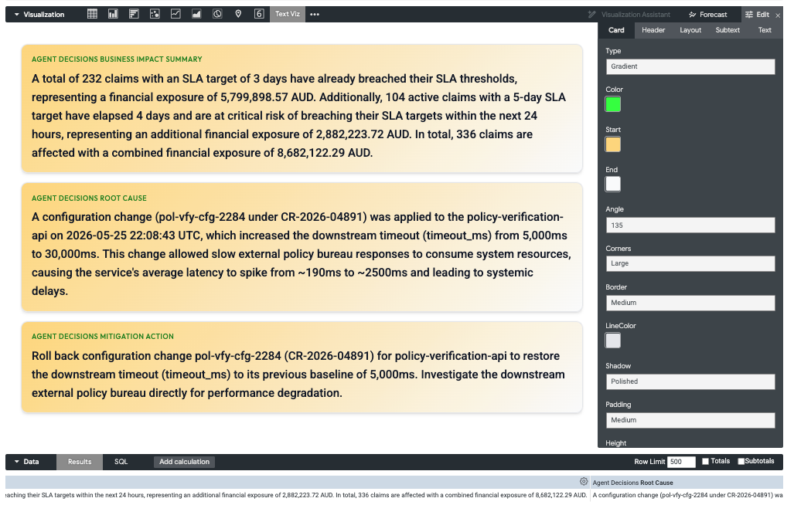

# Looker Text Tile Custom Visualization

A Looker Custom Visualization **Text Tile** (`text_tile`) that renders text dimensions in a polished, executive-friendly card format with fine-grained styling controls, dynamic typography imports, responsive layouts, and advanced text wrapping.



---

## Core Features

### 1. Dual Layout Modes

Configure how data maps to tiles directly in the **Layout** options:

- **Row-by-Row Mode (`rows`)**: Standard mode reading multiple rows from a single column. Each row generates a distinct tile. If a second dimension is in the query, it renders underneath as subtext.
- **Column-by-Column Mode (`columns`)**: Ideal for executive summary dashboards. Reads a single row containing multiple columns/dimensions. Each column maps to a dedicated card displaying its value.

### 2. Comma-Separated Header Overrides

You can customize individual card headers in both modes:

- Leave the header override **Text** field blank to default to Looker's dimension labels.
- Type a single string to apply that header to all cards.
- Type a comma-separated list (e.g. `"Active Process, Status, Hourly Capacity"`) to dynamically assign custom headers respectively to each card index.

### 3. Condensed Control Options

All sidebar settings and tabs have been shortened to concise, single-word labels (`'Layout'`, `'Header'`, `'Text'`, `'Subtext'`, and `'Card'`) to fit beautifully in Looker's narrow side panels without overflowing.

### 4. Robust Text Wrapping

Choose between three CSS behaviors in the **Wrap** settings:

- **Wrap**: Wraps text normally and breaks long words when needed.
- **Scroll**: Keeps text on a single line and adds a modern, thin horizontal scrollbar for overflow.
- **Truncate**: Cuts off text on a single line with a clean trailing ellipsis (`...`).

### 5. Polished Executive Aesthetics

- **Dynamic Fonts**: Dynamic imports for curated high-end Google Fonts (**Inter**, **Outfit**, **Roboto**, **Playfair Display**, and **Fira Code**).
- **Subtle Gradients**: Toggle between solid backgrounds and elegant dual-color linear gradients.
- **Borders and Corners**: Tailor line weights, colors, and corner radiuses (from sharp to pill).
- **Shadow Presets**: Pre-calibrated card shadows (None, Subtle, Polished, or Elevated).
- **Interactive Animations**: Cards respond to hover with a smooth 1px lift (`translateY(-1px)`) and deep shadow extensions.

---

## How to Deploy in Looker

### Option A: Central Administration (Admin URL)

1. Upload the compiled `texttile.js` file to a public web server or cloud storage bucket (e.g., GCS, AWS S3).
2. In Looker, navigate to **Admin > Platform > Visualizations**.
3. Click **Add Visualization** and fill out the form:
   - **ID**: `text_tile`
   - **Label**: `Text Tile`
   - **Main Provider**: Select **URL**.
   - **URL**: Input the public URL to your hosted `texttile.js` file.
   - **Dependencies**: Add the React UMD unpkg dependency links (one per line):
     ```text
     https://unpkg.com/react@16/umd/react.production.min.js
     https://unpkg.com/react-dom@16/umd/react-dom.production.min.js
     ```
4. Click **Save**.

### Option B: Local LookML Project

1. Copy the compiled `texttile.js` file into your LookML project folder in the Looker IDE.
2. Append the visualization declaration to your project's `manifest.lkml` file:
   ```lkml
   visualization: {
     id: "text_tile"
     file: "texttile.js"
     label: "Text Tile"
     dependencies: [
       "https://unpkg.com/react@16/umd/react.production.min.js",
       "https://unpkg.com/react-dom@16/umd/react-dom.production.min.js"
     ]
   }
   ```
3. Commit and Deploy changes to production.

---

## Development and Bundling

Source files are organized inside the `src/` directory:

- `src/index.js`: Entry point, Looker visualization registration, option schema configs, and data parsing.
- `src/TileGrid.js`: layout container.
- `src/Tile.js`: Card styling and rendering component.

### Setup

To install dependencies locally, run:

```bash
yarn install
```

### Live Reloading Dev Server

To run a live development server with hot reloading (serves at `https://localhost:8080/texttile.js`):

```bash
yarn dev
```

### Production Build

To compile and minimize the final bundle:

```bash
yarn build
```

This generates the optimized production bundle `texttile.js` in the root directory.
